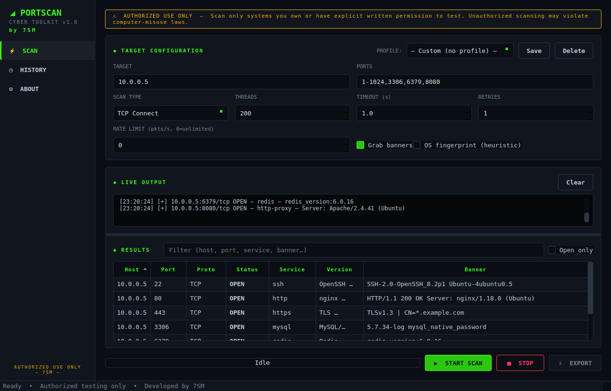
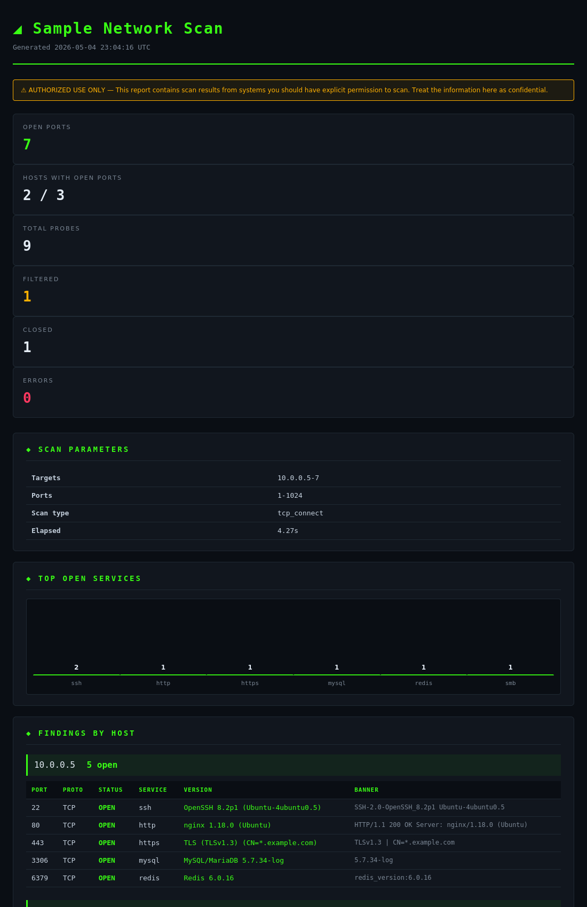

# Network Port Scanner

**Developed by: 7SM**

Multi-threaded TCP/SYN/UDP port scanner with banner grabbing, service version
detection, scan profiles, professional HTML reports, and a dark-themed PyQt6
GUI. Designed as an authorized security testing and learning tool.



## What's new in v1.1

- **Service version detection** — 28+ regex patterns extract product/version
  from banners (OpenSSH 8.2p1, nginx 1.18.0, Apache 2.4.41, Redis 6.0.16,
  MySQL, PostgreSQL, vsftpd, ProFTPD, Postfix, Dovecot, IIS, etc.)
- **Scan profiles** — 7 built-in profiles (Quick Scan, Web Servers, Databases,
  Remote Access, Mail, Full TCP, Stealth Slow). Save your own. Built-ins are
  protected.
- **HTML reports** — single-file, self-contained, professional dark-themed
  reports with summary stats, charts, and per-host findings.
- **Keyboard shortcuts** — Ctrl+R (run), Esc (stop), Ctrl+S (export),
  Ctrl+L/P/F (focus fields), Ctrl+K (clear).
- **Virtual table model** — handles millions of results without UI lag using
  Qt's model/view architecture.

## Screenshots

### Professional HTML Reports

Export scan results as a single self-contained HTML file with summary
statistics, service distribution chart, and per-host findings tables. No
external dependencies — open it in any browser or send to a client.



## ⚠ Disclaimer

**This tool is for authorized testing and educational use only.** Scanning
systems without explicit written permission of the owner is illegal in most
jurisdictions (CFAA in the US, Computer Misuse Act in the UK, similar laws
elsewhere) and can result in criminal prosecution. The authors accept no
liability for misuse.

## Honest Capability Notes

Most port scanner tutorials oversell what their tools can do. Here's the
truth:

| Feature | What it actually does |
| --- | --- |
| **TCP Connect scan** | Full three-way handshake. Reliable, works without privileges, easy to detect. |
| **SYN scan** | Only works with **root/Administrator privileges** + scapy installed. Falls back to TCP connect if unavailable, and tells you in the log. No silent lying. |
| **UDP scan** | Inherently unreliable. Silent ports show as `open|filtered` because that's the truth — nmap does the same. We send service-specific probes for DNS/NTP/SNMP to get real "open" answers when possible. |
| **OS fingerprinting** | TTL-based heuristic only. Real fingerprinting (à la nmap) needs dozens of stack-quirk probes — out of scope here. Result is labeled "heuristic only" so you don't trust it. |
| **Banner grabbing** | Works. TLS-wrapped ports do a real handshake and pull the cert CN. HTTP gets a `GET /`. SSH/FTP/SMTP just read the greeting. |
| **Threading up to 1000** | Configurable, but capped sensibly. Past ~500 threads on Python+sockets, you hit OS file descriptor limits and gain nothing. More threads ≠ faster. |
| **Rate limiting** | Token-bucket limiter for stealth. Note: rate limiting and high thread counts work against each other — pick fast OR stealthy. |

## Project Layout

```
portscanner/
├── __init__.py
├── __main__.py              # Entry point: GUI by default, --cli for headless
├── core/
│   ├── scanner.py           # ThreadPool + TCP/SYN/UDP probes + cancellation
│   ├── targets.py           # Target/port string parsing (IPs, CIDR, ranges)
│   ├── services.py          # Service signature DB + probe payloads
│   ├── exporters.py         # JSON / CSV / TXT exporters
│   └── history.py           # SQLite-backed scan history
├── gui/
│   ├── theme.py             # QSS stylesheet + color palette
│   ├── main_window.py       # Sidebar nav + page stack
│   ├── scan_view.py         # Main scan page
│   ├── history_view.py      # Past scans browser
│   └── settings_view.py     # About / paths
├── utils/
│   └── logger.py            # Rotating file logger setup
└── tests/
    └── test_core.py         # 32 unit + integration tests
```

## Installation

Requires Python 3.10+.

```bash
# Clone or copy the portscanner/ directory, then:
pip install PyQt6                # GUI
pip install scapy                # OPTIONAL — only for SYN scan
```

That's it — no other dependencies. SQLite ships with Python.

## Running

### GUI mode (default)

```bash
python -m portscanner
```

### CLI mode (headless / scriptable)

```bash
# Scan localhost ports 1-1024
python -m portscanner --cli 127.0.0.1 -p 1-1024

# Scan a CIDR range, UDP, save to CSV
python -m portscanner --cli 192.168.1.0/28 -p 53,123,161 -t udp --export out.csv

# SYN scan (needs sudo/admin)
sudo python -m portscanner --cli 192.168.1.1 -p 1-1024 -t syn

# Slow & polite — 50 packets per second
python -m portscanner --cli 192.168.1.1 -p 1-1000 --rate 50
```

CLI flags:

```
positional:
  targets              IP, hostname, CIDR, comma list, or a-b range

options:
  -p, --ports          Port spec (default: 1-1024)
  -t, --type           tcp|syn|udp (default: tcp)
  --threads            Worker threads (default: 200, cap 1000)
  --timeout            Per-probe timeout in seconds (default: 1.0)
  --retries            Retry count (default: 1)
  --rate               Rate limit pkts/s (0 = unlimited)
  --no-banners         Skip banner grabbing
  --export             Output file (.json | .csv | .txt)
  -v, --verbose        Debug logging
```

## Running Tests

```bash
# From the directory CONTAINING the portscanner/ folder:
python -m unittest portscanner.tests.test_core -v       # 32 tests
python -m unittest portscanner.tests.test_features -v   # 30 tests
```

**62 tests total**, all passing on Python 3.10+ on Linux/macOS/Windows.

Tests cover:
- Target/port parsing edge cases (CIDR, ranges, dedup, validation errors)
- TCP scan against a real ephemeral test server (banner grab, multiple ports)
- Closed port detection
- Streaming callbacks and progress events
- Cooperative cancellation
- All four export formats (HTML, JSON, CSV, TXT)
- SQLite history save / list / delete
- Service version detection (28+ patterns: OpenSSH, nginx, Apache, etc.)
- Profile save/load/persistence/built-in protection
- HTML report generation (escaping, empty results, charts)
- Virtual table model (filter, sort, scaling to thousands of rows)

## Sample Test Cases

### 1. Self-scan — verify the tool works

```bash
# Start a quick web server on port 8000
python -m http.server 8000 &

# Scan it
python -m portscanner --cli 127.0.0.1 -p 7999-8001
# Expect: 8000 open, 7999/8001 closed
```

### 2. Banner grabbing

```bash
# In the GUI, scan 127.0.0.1 with ports including 22 (if SSH is running)
# The banner column will show: SSH-2.0-OpenSSH_X.Y
```

### 3. CIDR scan

```bash
python -m portscanner --cli 192.168.1.0/29 -p 80,443 --threads 16
```

### 4. UDP scan with service detection

```bash
# Scan your local DNS / NTP services (if any)
sudo python -m portscanner --cli 127.0.0.1 -p 53,123,161 -t udp
```

### 5. Export to all formats

```bash
python -m portscanner --cli scanme.nmap.org -p 22,80,443 \
    --export results.json
python -m portscanner --cli scanme.nmap.org -p 22,80,443 \
    --export results.csv
python -m portscanner --cli scanme.nmap.org -p 22,80,443 \
    --export results.txt
```

(scanme.nmap.org is explicitly authorized for testing — see
[https://nmap.org/book/legal-issues.html](https://nmap.org/book/legal-issues.html))

## Architecture Decisions

**Why ThreadPoolExecutor and not asyncio?**
For I/O-bound work like socket connects, threads are simpler than asyncio
and the GIL doesn't bottleneck (we're blocking on syscalls). asyncio would
give better resource usage at high concurrency but at the cost of more
complex code. For the target use case — scanning up to a few thousand
ports — threads are the right call.

**Why SQLite for history?**
We could have used JSON files. SQLite gives us filtering, ordering, and
concurrent-access safety for free. The DB lives at `~/.portscanner/history.db`.

**Why throttle terminal updates?**
Streaming 10,000+ result lines straight to a `QPlainTextEdit` lags the GUI
hard. We buffer log/result lines and flush on a 10 Hz timer. This is
invisible to the user but makes large scans pleasant instead of janky.

**Why all the disclaimers?**
Because port scanning is a legally sensitive activity in most jurisdictions
and "but the tool let me" is not a legal defense. The disclaimer banner is
non-dismissable on purpose.

## What This Tool Is Not

- **Not nmap.** Nmap has 20+ years of work behind it. Use nmap for serious
  pen testing.
- **Not stealth.** Even in SYN mode, defenders can see the scan. If you need
  evasion, this is not your tool.
- **Not a vulnerability scanner.** It tells you ports are open and what
  service answers. It does not check for CVEs. Pair it with something like
  Nuclei if you need that.

## License

Use at your own risk. No warranty. Don't break the law.

---

```
╔══════════════════════════════════════════╗
║                                          ║
║          Developed by  7SM               ║
║                                          ║
╚══════════════════════════════════════════╝
```
